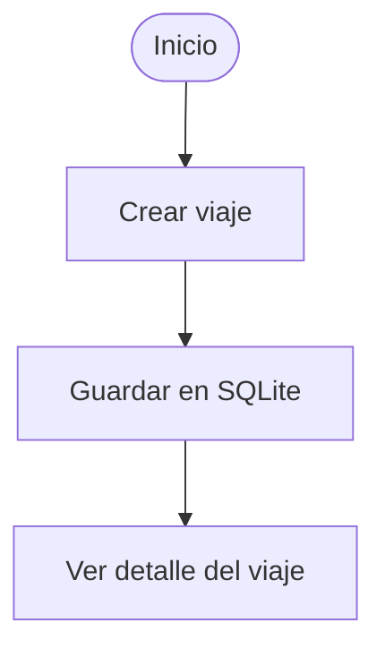
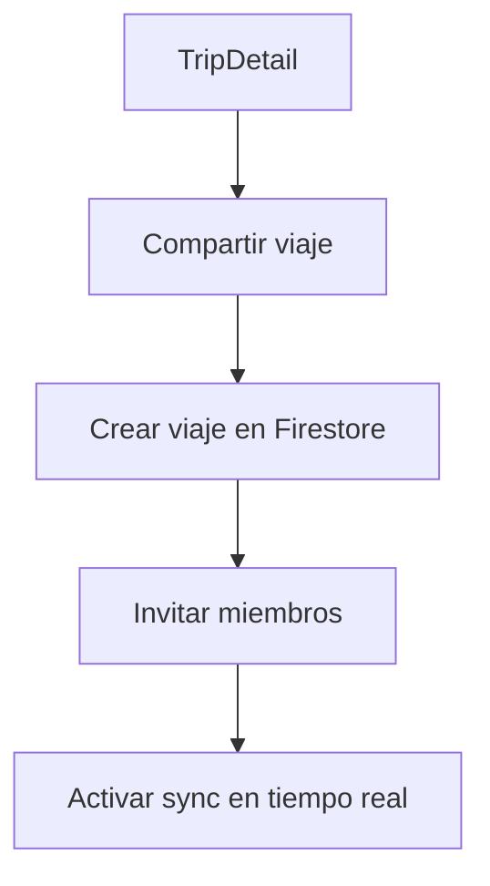
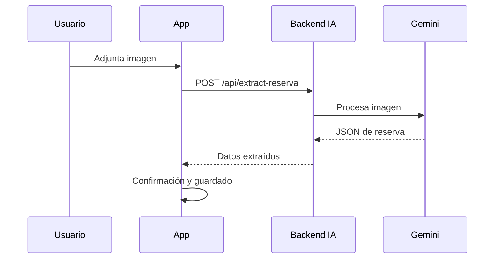

# User Flows

## Flujo: crear viaje

```mermaid
flowchart TD
  Start([Inicio]) --> CreateTrip[Crear viaje]
  CreateTrip --> SaveTrip[Guardar en SQLite]
  SaveTrip --> TripDetail[Ver detalle del viaje]
```

## Flujo: compartir viaje

```mermaid
flowchart TD
  TripDetail --> Share[Compartir viaje]
  Share --> Firestore[Crear viaje en Firestore]
  Firestore --> Invite[Invitar miembros]
  Invite --> Sync[Activar sync en tiempo real]
```

## Flujo: añadir reserva desde imagen

```mermaid
sequenceDiagram
  participant User as Usuario
  participant App as App
  participant Backend as Backend IA
  participant Gemini as Gemini

  User->>App: Adjunta imagen
  App->>Backend: POST /api/extract-reserva
  Backend->>Gemini: Procesa imagen
  Gemini-->>Backend: JSON de reserva
  Backend-->>App: Datos extraídos
  App->>App: Confirmación y guardado
```

