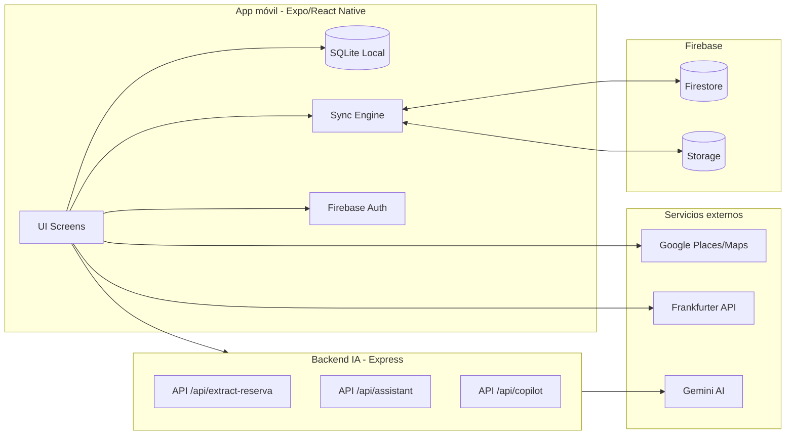

# Architecture Overview

## Arquitectura a alto nivel
La solución se compone de:
- **App móvil (Expo/React Native)**: UI, lógica de dominio, SQLite local y sincronización.
- **Firebase**: Auth + Firestore + Storage para viajes compartidos.
- **Backend IA (Express)**: endpoints para extracción de reservas y asistente Copilot.
- **APIs externas**: Google Places/Maps y Frankfurter.

## Diagrama de componentes (Mermaid)

## Límites de contexto y responsabilidades por módulo
- **App móvil**: orquestación de viajes, datos locales, UI, sincronización en viajes compartidos.
- **Firebase**: almacenamiento remoto de entidades y archivos.
- **Backend IA**: procesamiento con Gemini (texto + visión).
- **Servicios externos**: datos geográficos y tasas de cambio.

## Observaciones
- No existe un backend propio para viajes; Firestore actúa como backend de datos compartidos.
- La sincronización es híbrida: **offline-first** con SQLite y **online** con Firestore en viajes compartidos.

