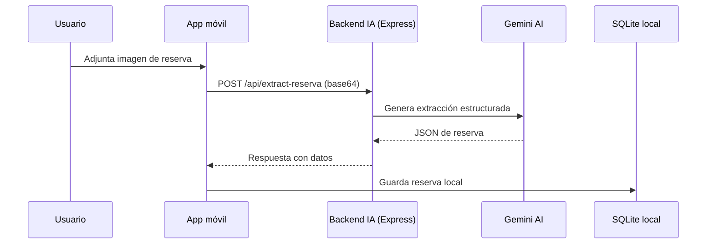
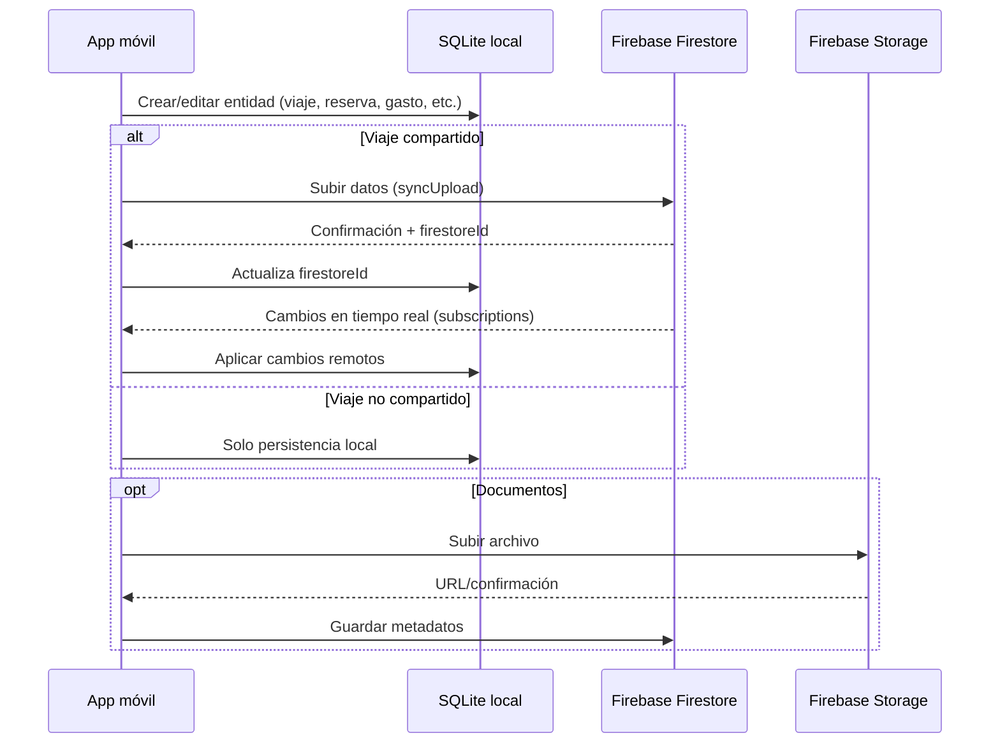

# Data Flow & Sync

## Flujo end-to-end: extracción de reserva desde imagen

## Flujo end-to-end: viaje compartido (sync)

## Estrategia de sincronización (resumen)
- **Offline-first**: SQLite es la fuente primaria local.
- **Sync bidireccional**: subidas y descargas con Firestore cuando el viaje es compartido.
- **Identidad dual**: cada entidad puede tener `id` local y `firestoreId` remoto.
- **Tiempo real**: listeners Firestore actualizan SQLite en background.

## Consistencia y conflictos
- Se observa lógica de “vinculación” por `localId` y `firestoreId`.
- **PENDIENTE / TODO**: política formal de resolución de conflictos (prioridad temporal, merge, etc.).

