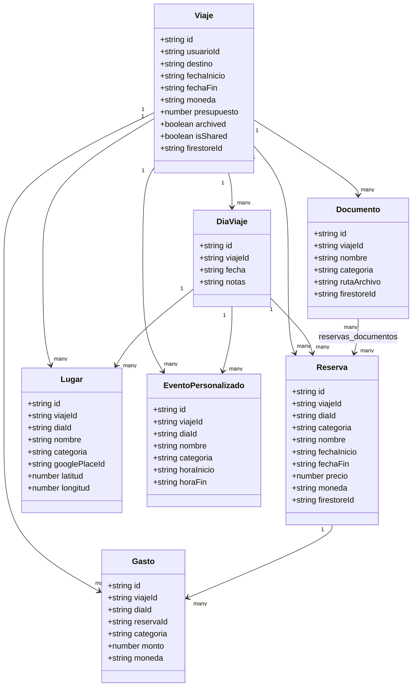

# Modelo de dominio

## Entidades principales (Mermaid classDiagram)

## Glosario funcional
- **Viaje**: entidad raíz con destino, fechas y configuración.
- **Día de viaje**: segmentación temporal del itinerario.
- **Reserva**: confirmación de transporte/hotel/comida/actividad.
- **Lugar**: POI/ubicación asociada al viaje.
- **Documento**: archivo adjunto (billetes, PDFs).
- **Gasto**: registro financiero asociado al viaje.
- **Evento personalizado**: actividad en agenda creada por el usuario.

