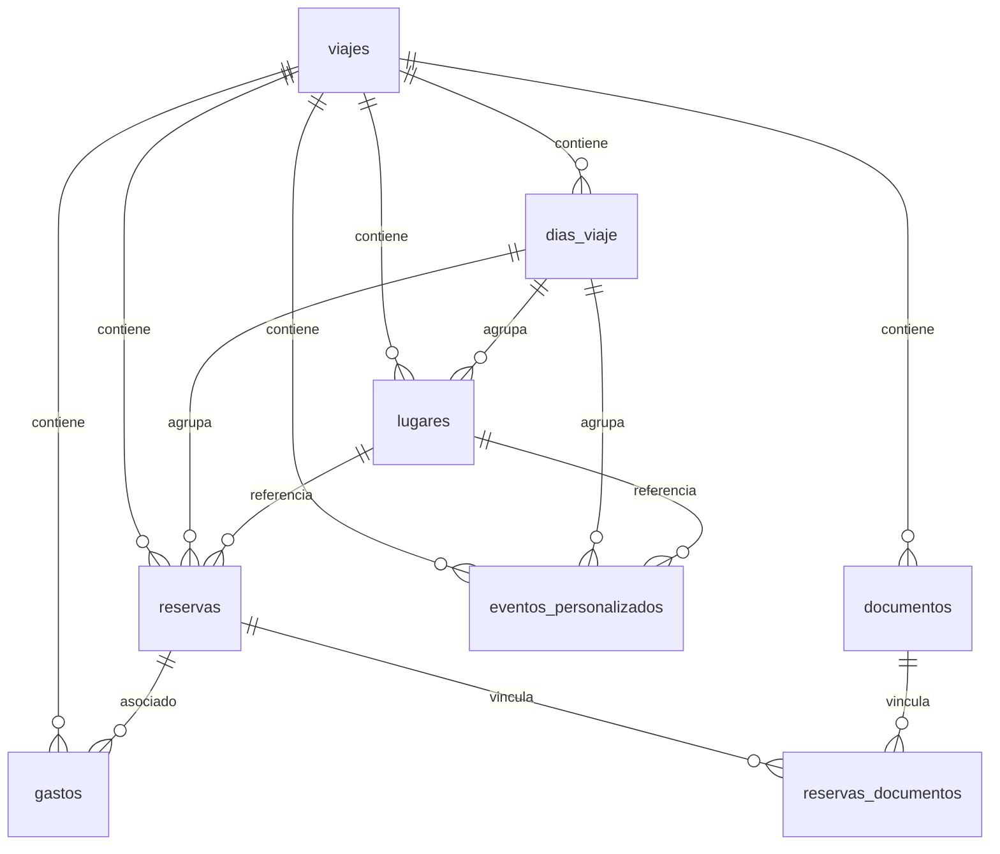

# Esquema de base de datos (SQLite)

## Versión de esquema
- **CURRENT_SCHEMA_VERSION = 18**

## Tablas principales

### viajes
| Columna | Tipo | Notas |
|---|---|---|
| id | TEXT | PK |
| usuarioId | TEXT | requerido |
| destino | TEXT | requerido |
| destinoPlaceId | TEXT | opcional |
| fechaInicio | TEXT | requerido |
| fechaFin | TEXT | requerido |
| descripcion | TEXT | opcional |
| imagenUrl | TEXT | opcional |
| presupuesto | REAL | opcional |
| moneda | TEXT | default 'EUR' |
| numViajeros | INTEGER | default 1 |
| archived | INTEGER | default 0 |
| isShared | INTEGER | default 0 |
| firestoreId | TEXT | opcional |
| syncedAt | TEXT | opcional |
| createdAt | TEXT | requerido |
| updatedAt | TEXT | requerido |

### dias_viaje
| Columna | Tipo | Notas |
|---|---|---|
| id | TEXT | PK |
| viajeId | TEXT | FK -> viajes |
| fecha | TEXT | requerido |
| notas | TEXT | opcional |
| createdAt | TEXT | requerido |
| updatedAt | TEXT | requerido |

### reservas
| Columna | Tipo | Notas |
|---|---|---|
| id | TEXT | PK |
| viajeId | TEXT | FK -> viajes |
| diaId | TEXT | FK -> dias_viaje |
| categoria | TEXT | requerido |
| nombre | TEXT | requerido |
| proveedor | TEXT | opcional |
| numeroConfirmacion | TEXT | opcional |
| fechaInicio | TEXT | opcional |
| horaInicio | TEXT | opcional |
| fechaFin | TEXT | opcional |
| horaFin | TEXT | opcional |
| ubicacion | TEXT | opcional |
| direccion | TEXT | opcional |
| latitud | REAL | opcional |
| longitud | REAL | opcional |
| precio | REAL | opcional |
| moneda | TEXT | default 'EUR' |
| estadoPago | TEXT | default 'pending' |
| paidByUserId | TEXT | opcional |
| splitMethod | TEXT | default 'equal' |
| participantUids | TEXT | opcional |
| shares | TEXT | opcional |
| notas | TEXT | opcional |
| metadatos | TEXT | opcional |
| documentoId | TEXT | FK -> documentos |
| lugarId | TEXT | FK -> lugares |
| createdAt | TEXT | requerido |
| updatedAt | TEXT | requerido |

### lugares
| Columna | Tipo | Notas |
|---|---|---|
| id | TEXT | PK |
| viajeId | TEXT | FK -> viajes |
| diaId | TEXT | FK -> dias_viaje |
| nombre | TEXT | requerido |
| descripcion | TEXT | opcional |
| categoria | TEXT | opcional |
| direccion | TEXT | opcional |
| latitud | REAL | opcional |
| longitud | REAL | opcional |
| googlePlaceId | TEXT | opcional |
| orden | INTEGER | default 0 |
| visitado | INTEGER | default 0 |
| createdAt | TEXT | requerido |
| updatedAt | TEXT | requerido |

### documentos
| Columna | Tipo | Notas |
|---|---|---|
| id | TEXT | PK |
| viajeId | TEXT | FK -> viajes |
| nombre | TEXT | requerido |
| categoria | TEXT | requerido |
| tipoArchivo | TEXT | requerido |
| rutaArchivo | TEXT | requerido |
| tamano | INTEGER | opcional |
| firestoreId | TEXT | opcional |
| createdAt | TEXT | requerido |
| updatedAt | TEXT | requerido |

### gastos
| Columna | Tipo | Notas |
|---|---|---|
| id | TEXT | PK |
| viajeId | TEXT | FK -> viajes |
| diaId | TEXT | FK -> dias_viaje |
| reservaId | TEXT | FK -> reservas |
| categoria | TEXT | requerido |
| descripcion | TEXT | requerido |
| monto | REAL | requerido |
| moneda | TEXT | default 'EUR' |
| fecha | TEXT | requerido |
| createdAt | TEXT | requerido |
| updatedAt | TEXT | requerido |

### reservas_documentos
| Columna | Tipo | Notas |
|---|---|---|
| id | TEXT | PK |
| reservaId | TEXT | FK -> reservas |
| documentoId | TEXT | FK -> documentos |
| createdAt | TEXT | requerido |

### eventos_personalizados
| Columna | Tipo | Notas |
|---|---|---|
| id | TEXT | PK |
| viajeId | TEXT | FK -> viajes |
| diaId | TEXT | FK -> dias_viaje |
| nombre | TEXT | requerido |
| descripcion | TEXT | opcional |
| categoria | TEXT | default 'other' |
| horaInicio | TEXT | opcional |
| horaFin | TEXT | opcional |
| duracionMinutos | INTEGER | opcional |
| ubicacion | TEXT | opcional |
| direccion | TEXT | opcional |
| latitud | REAL | opcional |
| longitud | REAL | opcional |
| lugarId | TEXT | FK -> lugares |
| notas | TEXT | opcional |
| completado | INTEGER | default 0 |
| prioridad | TEXT | default 'media' |
| createdAt | TEXT | requerido |
| updatedAt | TEXT | requerido |

## Índices
- Índices en `viajes`, `dias_viaje`, `reservas`, `lugares`, `documentos`, `gastos`, `eventos_personalizados`.

## Migraciones
- Controladas por tabla `_migrations` y funciones en `migrations.ts`.

## Diagrama ER (Mermaid)

