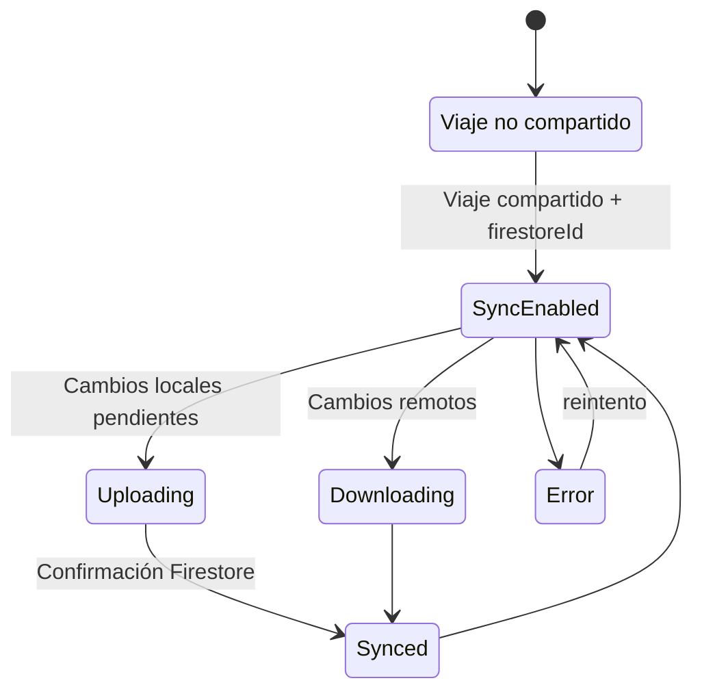

# Estrategia de sincronización

## Principios
- **Offline-first**: SQLite es la fuente primaria local.
- **Sincronización condicional**: solo viajes con `isShared=1` y `firestoreId`.
- **Tiempo real**: listeners Firestore para lugares, reservas, eventos, documentos, gastos.

## State diagram (Mermaid)

## Reintentos y conflictos
- Se observan reintentos en descargas y logs de sincronización.
- **PENDIENTE / TODO**: política formal de resolución de conflictos y backoff.

