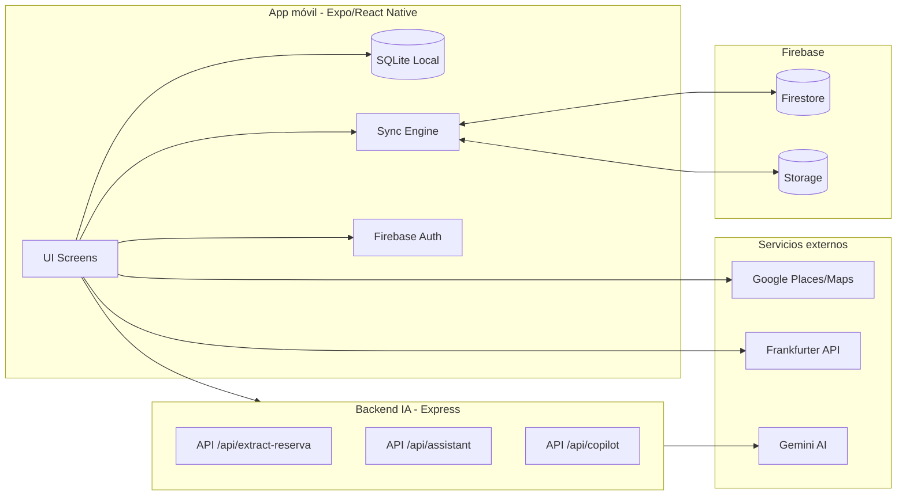
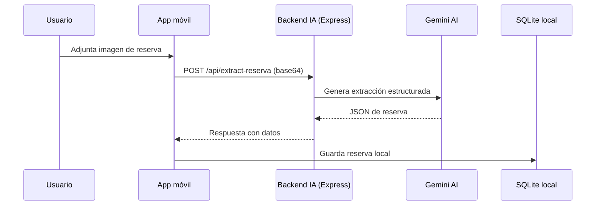
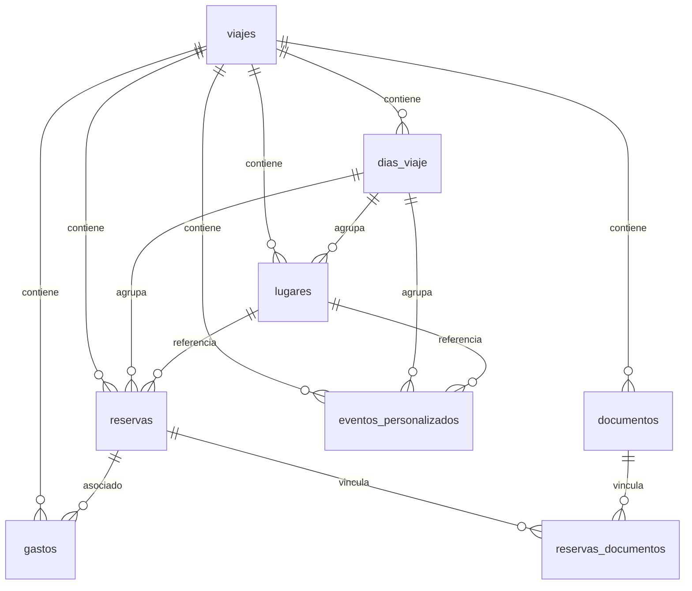
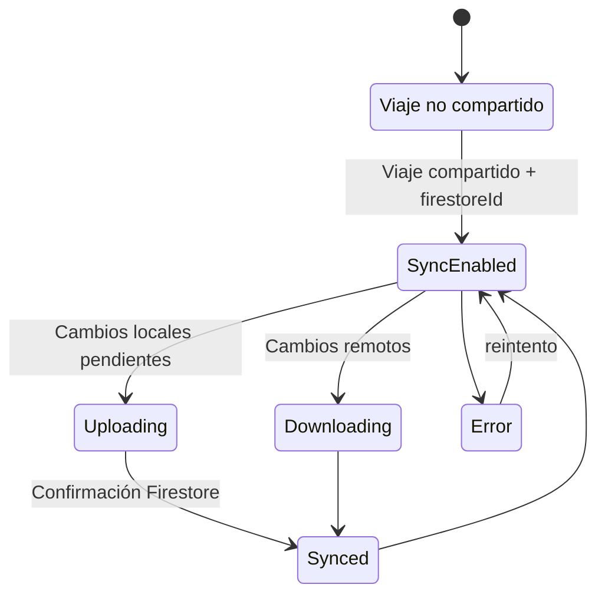

# Diagramas centralizados

## Diagrama de componentes
Fuente: [10_ARCHITECTURE_OVERVIEW.md](./10_ARCHITECTURE_OVERVIEW.md)

## Diagrama de secuencia: extracción de reserva
Fuente: [12_DATA_FLOW_AND_SYNC.md](./12_DATA_FLOW_AND_SYNC.md)

## ERD SQLite
Fuente: [40_DATABASE_SCHEMA.md](./40_DATABASE_SCHEMA.md)

## State diagram de sync
Fuente: [41_SYNC_STRATEGY.md](./41_SYNC_STRATEGY.md)

